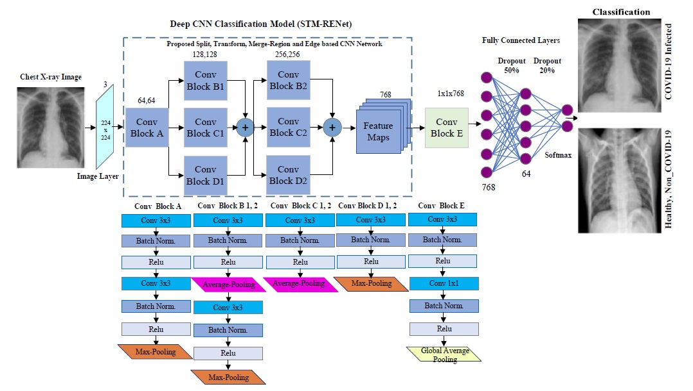
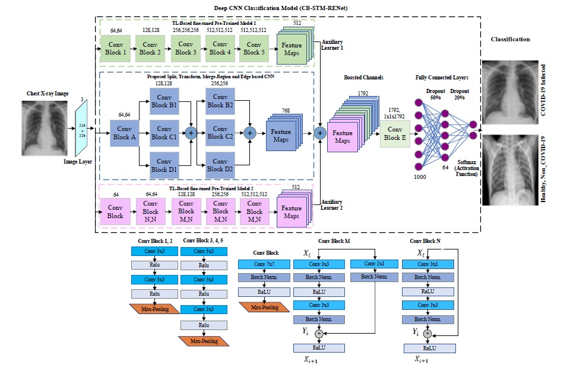
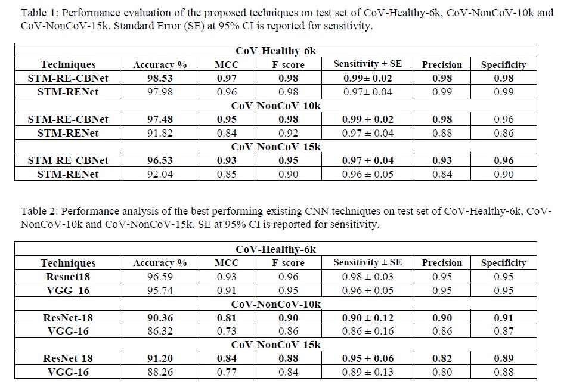

# COVID-19 Detection in Chest X-Ray Images using a New Channel Boosted CNN

COVID-19 is a highly contagious respiratory infection that has affected a large population across the world and continues with its devastating consequences. It is imperative to detect COVID-19 at the earliest to limit the span of infection. In this work, a new classification technique “CB-STM-RENet” based on deep Convolutional Neural Network (CNN) and Channel Boosting is developed for the detection of COVID-19 from chest X-Rays. In this connection, to learn the COVID-19 specific radiographic patterns, a new convolution block based on split-transform-merge (STM) is developed. This new block systematically incorporates region and edge base operations at each branch to capture the diverse set of features at various levels, especially those related to region homogeneity, textural variations, and boundaries of the infected region. We further enhanced the learning and discrimination capability of the proposed CNN architecture by exploiting the Channel Boosting idea that concatenates the auxiliary channels along with the original channels. The auxiliary channels are generated by employing Transfer Learning-based domain adaption of the pre-trained CNN architectures. The effectiveness of the proposed technique “CB-STM-RENet” is evaluated on three different datasets containing CoV-Healthy-6k, CoV-NonCoV-10k, and CoV-NonCoV-15k Chest X-Ray images, respectively. The performance comparison of the proposed deep CB-STM-RENet with the existing techniques exhibits high classification performance both in discriminating COVID-19 chest infections from healthy, as well as, other types of chest infections. CB-STM-RENet provides the highest performance on all these three datasets; especially on the stringent CoV-NonCoV-15k dataset. The good detection rate (97%), and high precision (93%) of the proposed technique suggest that it can be adapted for the diagnosis of COVID-19 infected patients.

In this repository, we provide the MATLAB GUI and Testing Code for the COVID-19 Detection in Chest X-Ray images for the research community to use our research work.

## Overview of the workflow for the proposed COVID-19 Detection Framework

This work proposes a new technique based on CB CNN for automated detection of COVID-19 from chest X-Ray images. The proposed technique targets the discrimination of COVID-19 infected from both non-COVID-19 infected and Healthy individual. In this regard, a new CNN classifier based on novel split-transform-merge (STM) block is developed that systematically implements RE-based operations for the learning of COVID-19 specific patterns and termed as “STM-RENet”. The learning capacity of the proposed CNN is enhanced using Channel Boosting to improve the detection rate while maintaining high precision. The CB CNN is termed as “CB-STM-RENet”. The performance of the proposed technique is compared with several existing CNNs by implementing them from scratch as well as by adapting them using TL on X-Ray dataset for COVID-19 detection. The overall workflow is shown in Figure 1.


## Models Architecture

### Architectural details of the proposed STM-RENet



### Architectural details of the proposed CB-STM-RENet



## Dataset

Three different Chest X-Ray images datasets were used.

1. CoV-Healthy-6k
2. CoV-NonCoV-10k
3. CoV-NonCoV-15k

Find Dataset [here](https://drive.google.com/drive/folders/1_KCNt64Y4bkdMnikZ5qoCc7bxnkHxq34?usp=sharing)

## Results



## Citation

This work is done by Saddam Hussain Khan, Anabia Sohail and Asifullah Khan. The Arxiv version of the paper can be downloaded from [here](https://arxiv.org/abs/2012.05073):
If you find this work useful, you can refer our work as:

```Bibtex formatted citation
@misc{khan2020covid19,
      title={COVID-19 Detection in Chest X-Ray Images using a New Channel Boosted CNN},
      author={Saddam Hussain Khan and Anabia Sohail and Asifullah Khan},
      year={2020},
      eprint={2012.05073},
      archivePrefix={arXiv},
      primaryClass={eess.IV}
}
```
